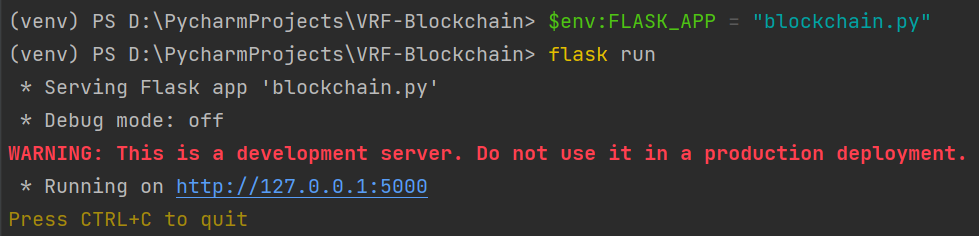
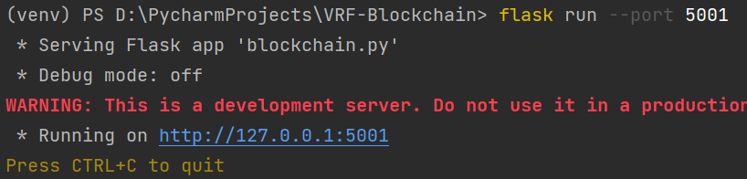
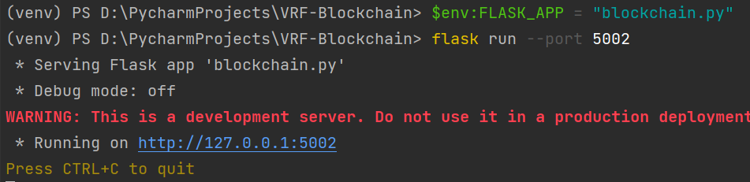
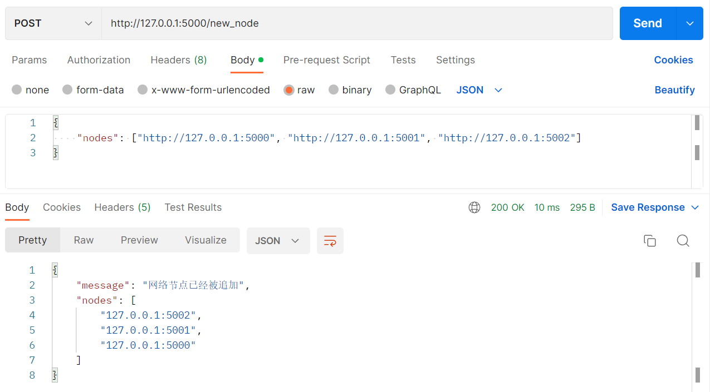
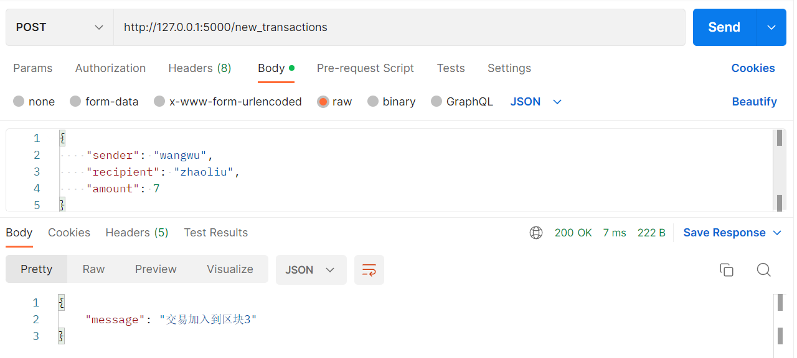
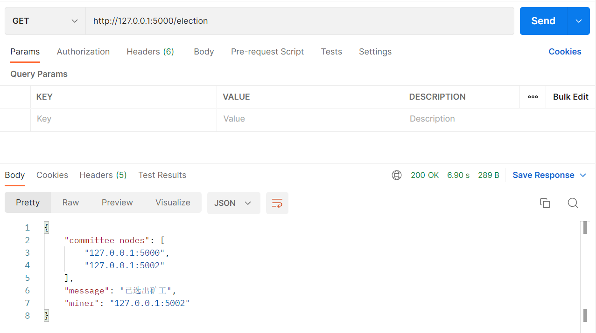
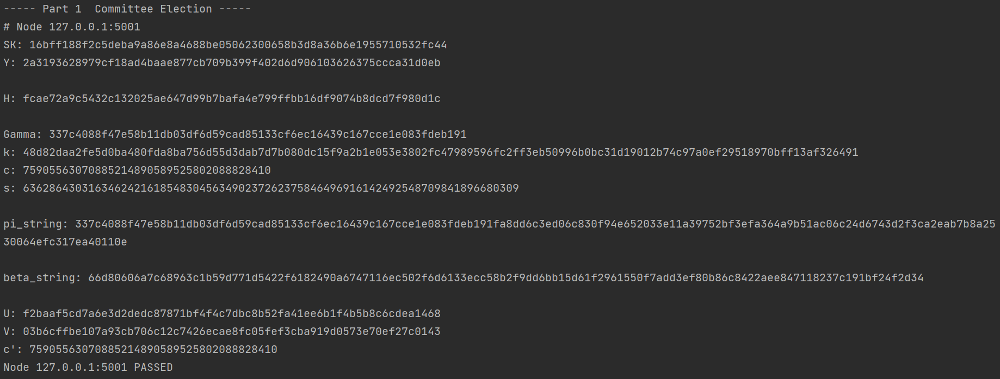
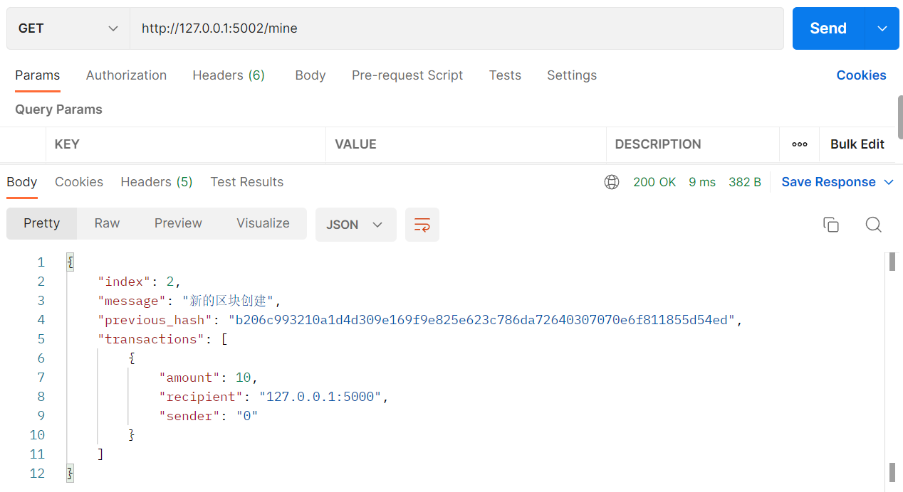
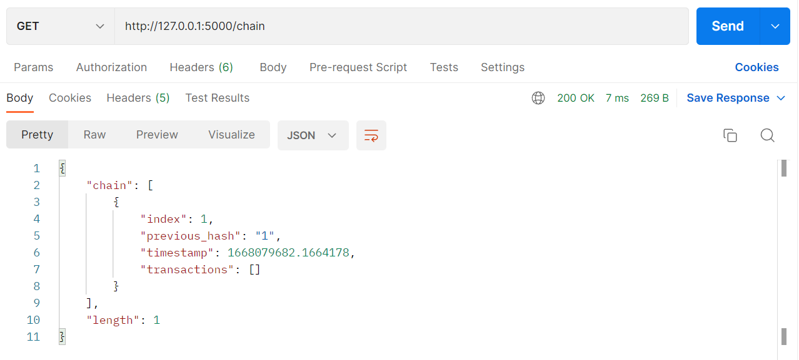
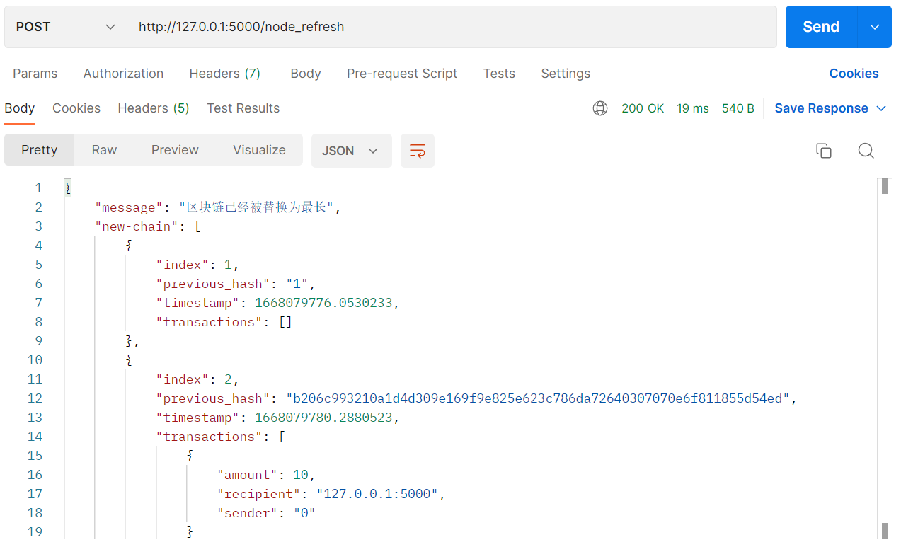

dhvrf.py: double-hash VRF全流程
election.py: 两个函数，委员节点的选举和矿工的选举
blockchain.py: 用flask模拟区块链和节点

在terminal中输入以下两行代码，app开始在localhost:5000运行
$env:FLASK_APP = "blockchain.py"
flask run        # 节点1，默认5000端口

在新的terminal中输入以下代码，app可以在更多端口运行
$env:FLASK_APP = "blockchain.py"
flask run --port 5001      # 节点2，5001端口

同理
$env:FLASK_APP = "blockchain.py"
flask run --port 5002      # 节点3，5002端口

使用Postman软件，向http://127.0.0.1:5000/new_node网页发送三个节点的信息，选择POST
Send之后，app调用blockchain.py中new_node()函数，对三个新节点进行注册

向http://127.0.0.1:5000/new_transactions网页发送一条交易信息，选择POST
Send之后，app调用blockchain.py中new_transactions()函数，将交易信息存入区块链的下一个区块

从http://127.0.0.1:5000/election网页获得选举信息，选择GET
Send之后，app调用blockchain.py中show_election()函数，网页显示选举结果

terminal中包含每个节点的VRF具体过程

比如此次从三个节点中选出的矿工是5002端口的节点
在http://127.0.0.1:5002/mine网页进行挖矿，获得挖矿信息，选择GET

从http://127.0.0.1:5002/chain网页可以获得更新后的区块链信息，选择GET
区块链末端多了刚才挖矿生成的区块

但是其他节点的区块链还未更新

在http://127.0.0.1:5000/node_refresh网页可以在该节点更新区块链，选择POST，

其他节点同理